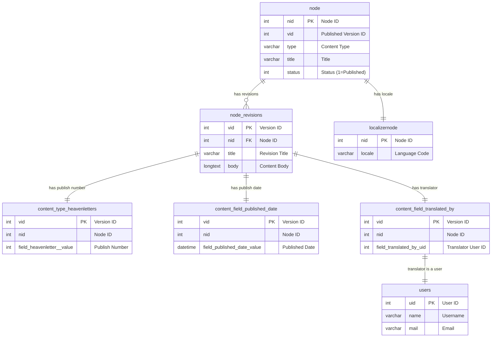

 # Natural Language Query Tool for Heavenletters Database

This document provides comprehensive instructions for an AI agent to translate natural language queries into SQL statements for the Heavenletters database. The database uses a legacy Drupal 5.x schema with Content Construction Kit (CCK) fields.

## Overview

The Heavenletters database contains:
- **64,510+ legacy nodes** from Drupal 5.x
- **Heavenletters content** (the main content type)
- **Translation system** with multiple language versions
- **User system** for authors and translators
- **Complex relationships** between nodes, revisions, and custom fields

## Core Database Schema

### Primary Tables

#### `node` (Central Content Table)
```sql
nid int(10) unsigned NOT NULL auto_increment PRIMARY KEY,  -- Unique node ID
vid int(10) unsigned NOT NULL default '0',                -- Published version ID (not for joins!)
type varchar(32) NOT NULL default '',                     -- Content type ('heavenletters')
title longtext,                                           -- Node title
status int(11) NOT NULL default '1'                       -- 1=Published, 0=Draft
```

**Critical Notes:**
- `nid` is the primary identifier for all content
- `vid` points to the currently published revision (NOT for joining with CCK tables)
- Always join via `vid` from `node_revisions` for CCK field tables

#### `node_revisions` (Content Versions)
```sql
vid int(10) unsigned NOT NULL auto_increment PRIMARY KEY,  -- Version ID (unique)
nid int(10) unsigned NOT NULL default '0',                -- Node ID (foreign key)
title longtext,                                           -- Revision title
body longtext                                             -- HTML content
```

**Critical Notes:**
- Each node can have multiple revisions (history)
- Always use the LATEST revision (max `vid` per `nid`) for current content
- Use `vid` from this table to join with ALL CCK field tables

#### `localizernode` (Language/Locale Mapping)
```sql
nid int(10) unsigned NOT NULL default '0' PRIMARY KEY,    -- Node ID
locale varchar(12) NOT NULL default ''                    -- Language code ('eng', 'de', 'fr', etc.)
```

**Critical Notes:**
- Maps nodes to their language versions
- Use for filtering by language/locale

#### `users` (User Information)
```sql
uid int(10) unsigned NOT NULL auto_increment PRIMARY KEY,  -- User ID
name varchar(60) NOT NULL default '',                     -- Username
pass varchar(32) NOT NULL default '',                     -- Password hash
mail varchar(64) default '',                              -- Email
mode tinyint(4) NOT NULL default '0',                     -- Display mode
sort tinyint(4) default '0',                               -- Sort order
threshold tinyint(4) default '0',                          -- Comment threshold
theme varchar(255) NOT NULL default '',                   -- Theme
signature varchar(255) NOT NULL default '',               -- Signature
created int(11) NOT NULL default '0',                     -- Account creation timestamp
access int(11) NOT NULL default '0',                      -- Last access timestamp
login int(11) NOT NULL default '0',                       -- Last login timestamp
status tinyint(4) NOT NULL default '1',                   -- Account status (1=Active)
timezone varchar(8) default '',                           -- Timezone
language varchar(12) NOT NULL default '',                 -- Preferred language
picture varchar(255) NOT NULL default '',                 -- Avatar picture path
init varchar(64) default '',                              -- Initial email used for account
data longtext                                             -- Serialized user data
```

### CCK Field Tables (Content Type: heavenletters)

#### `content_type_heavenletters` (Publish Number)
```sql
vid int(10) unsigned NOT NULL default '0' PRIMARY KEY,    -- Version ID (foreign key)
nid int(10) unsigned NOT NULL default '0',                -- Node ID
field_heavenletter__value int(11) default NULL            -- Official publish number
```

#### `content_field_published_date` (Publication Date)
```sql
vid int(10) unsigned NOT NULL default '0' PRIMARY KEY,    -- Version ID (foreign key)
nid int(10) unsigned NOT NULL default '0',                -- Node ID
field_published_date_value datetime default NULL          -- Publication date (YYYY-MM-DD HH:MM:SS)
```

#### `content_type_heavenletters` (Publish Number & Translator Information)
```sql
vid int(10) unsigned NOT NULL default '0' PRIMARY KEY,    -- Version ID (foreign key)
nid int(10) unsigned NOT NULL default '0',                -- Node ID
field_heavenletter__value int(11) default NULL            -- Official publish number
field_translated_by_uid int(10) unsigned default NULL     -- Translator user ID (from users.uid)
```

## Entity-Relationship Diagram



## Translation System

### How Translations Work
1. **Translation Sets**: Identified by `tnid` in the `node` table
2. **Language Versions**: Each translation is a separate node with its own `nid`
3. **Shared TNID**: All translations in a set share the same `tnid` value
4. **Locale Mapping**: `localizernode.locale` indicates the language ('eng', 'de', 'fr', etc.)

### Example Translation Structure
```
tnid: 123 (Translation Set)
├── nid: 123, locale: 'eng' (Original English)
├── nid: 124, locale: 'de' (German translation by user 42)
└── nid: 125, locale: 'fr' (French translation by user 53)
```

## Critical Query Patterns

### Basic Heavenletter Query (English Only)
```sql
SELECT
  nr.title,
  nr.body,
  cth.field_heavenletter__value AS publishNumber,
  cpd.field_published_date_value AS publishedOn
FROM node n
INNER JOIN localizernode ln ON n.nid = ln.nid AND ln.locale = 'eng'
INNER JOIN (
  SELECT nid, MAX(vid) AS max_vid
  FROM node_revisions
  GROUP BY nid
) AS max_rev ON n.nid = max_rev.nid
INNER JOIN node_revisions nr ON max_rev.max_vid = nr.vid
LEFT JOIN content_type_heavenletters cth ON nr.vid = cth.vid
LEFT JOIN content_field_published_date cpd ON nr.vid = cpd.vid
WHERE n.type = 'heavenletters' AND n.status = 1
ORDER BY COALESCE(cth.field_heavenletter__value, n.nid) ASC;
```

### Query with Translator Information
```sql
SELECT
  nr.title,
  u.name AS translator_username,
  cth.field_heavenletter__value AS publishNumber
FROM node n
INNER JOIN localizernode ln ON n.nid = ln.nid AND ln.locale = 'de'
INNER JOIN (
  SELECT nid, MAX(vid) AS max_vid
  FROM node_revisions
  GROUP BY nid
) AS max_rev ON n.nid = max_rev.nid
INNER JOIN node_revisions nr ON max_rev.max_vid = nr.vid
LEFT JOIN content_type_heavenletters cth ON nr.vid = cth.vid
LEFT JOIN content_field_translated_by ctb ON nr.vid = ctb.vid
LEFT JOIN users u ON ctb.field_translated_by_uid = u.uid
WHERE n.type = 'heavenletters' AND n.status = 1
ORDER BY cth.field_heavenletter__value ASC;
```

## AI Agent Instructions

### Understanding User Queries
1. **Identify the core request**: Count, list, filter, aggregate Heavenletters
2. **Determine language/locale**: Default to 'eng' if not specified
3. **Handle duplicates**: Use publish numbers for unique identification
4. **Include translator info**: Join with users table via field_translated_by_uid when needed

### Query Construction Rules
1. **Always filter for published content**: `n.status = 1 AND n.type = 'heavenletters'`
2. **Always use latest revisions**: Subquery for MAX(vid) per nid
3. **Join CCK tables on revision vid**: Never on node.vid
4. **Handle missing data**: Use LEFT JOINs and COALESCE for null values
5. **Order by publish number**: `COALESCE(cth.field_heavenletter__value, n.nid)`

### Common Query Patterns
- **Count by language**: Filter by locale, use COUNT(*)
- **Find by translator**: Join content_field_translated_by → users
- **Aggregate by date**: Use content_field_published_date
- **Unique by publish number**: GROUP BY field_heavenletter__value

### Example Translations

#### "How many German Heavenletters were translated by theophil?"
```sql
SELECT COUNT(*) as total_translated
FROM node n
INNER JOIN localizernode ln ON n.nid = ln.nid AND ln.locale = 'de'
INNER JOIN (
  SELECT nid, MAX(vid) AS max_vid
  FROM node_revisions
  GROUP BY nid
) AS max_rev ON n.nid = max_rev.nid
INNER JOIN node_revisions nr ON max_rev.max_vid = nr.vid
INNER JOIN content_field_translated_by ctb ON nr.vid = ctb.vid
INNER JOIN users u ON ctb.field_translated_by_uid = u.uid
WHERE n.type = 'heavenletters'
  AND n.status = 1
  AND u.name = 'theophil';
```

#### "List all translators and their translation counts"
```sql
SELECT
  u.name AS translator,
  COUNT(*) as translation_count
FROM users u
INNER JOIN content_field_translated_by ctb ON u.uid = ctb.field_translated_by_uid
INNER JOIN node_revisions nr ON ctb.vid = nr.vid
INNER JOIN node n ON nr.nid = n.nid
WHERE n.type = 'heavenletters' AND n.status = 1
GROUP BY u.uid, u.name
ORDER BY translation_count DESC;
```

## Environment Variables
The tool uses the same database connection as the backend. Ensure `DATABASE_URL` is set in the environment or `.env` file.

## Safety Notes
- All queries are read-only (SELECT statements only)
- No data modification operations are allowed
- Results should be paginated for large datasets
- Always validate queries before execution
## Gemini API Integration

This tool uses the Google Gemini API to translate natural language queries into SQL. To use this feature, you must provide a valid Gemini API key.

### Setup Instructions

1.  **Obtain a Gemini API Key**:
    *   Visit the [Google AI for Developers](https://ai.google.dev/) website.
    *   Sign in with your Google account and create a new API key in the Google AI Studio.

2.  **Locate the `backend/.env` File**:
    *   In the `backend` directory of this project, locate the `.env` file. If it doesn't exist, copy the `backend/.env.sample` file to `backend/.env`.

3.  **Add the API Key to `backend/.env`**:
    *   Open the `backend/.env` file and add the following line, replacing `CHANGE_ME` with your actual API key:

    ```
    GEMINI_API_KEY=CHANGE_ME
    ```

4.  **Run the Tool**:
    *   Once the `.env` file is configured, you can run the tool as usual:

    ```bash
    node natural_query.js
    ```

The tool will automatically load your API key from the `.env` file and use it to communicate with the Gemini API.