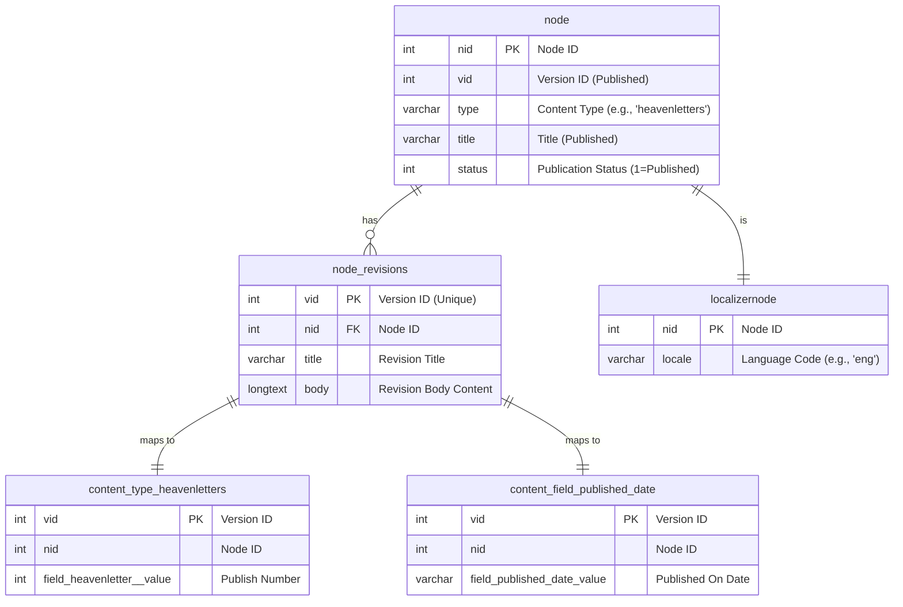

# Drupal 5 Legacy Database Schema Guide

## 1. Overview

This document provides a comprehensive guide to the legacy Drupal 5 database schema used by the Heavenletters project. Its purpose is to consolidate all critical information discovered during the development of the `export-heavenletters.js` script, making it easier for future developers and agents to understand the complex table relationships and data retrieval logic.

The schema is characterized by its use of the **Content Construction Kit (CCK)**, which stores custom fields in separate tables, and a revisioning system that creates multiple versions of each piece of content. Understanding the relationships between the core `node` table, the `node_revisions` table, and the various CCK field tables is essential for accurate data extraction.

## 2. Entity-Relationship Diagram (ERD)

The following Mermaid diagram illustrates the key relationships between the tables required to assemble a complete Heavenletter record.



**Key Takeaways from the ERD:**
-   The `node` table holds the primary identifier (`nid`) and the currently **published** version ID (`vid`).
-   The `node_revisions` table contains the actual content (`body`, `title`) for **every** version of a node. The latest version is identified by the highest `vid` for a given `nid`.
-   **Crucially, all CCK field tables (like `content_type_heavenletters`) must be joined using the revision ID (`vid`) from `node_revisions`, not the published `vid` from the `node` table.**
-   The `localizernode` table is used to filter content by language.

## 3. Core Table Breakdowns

### `node`
This is the central table for all content. Each row represents a unique piece of content, identified by `nid`.

| Field | Description | Critical Notes |
| :--- | :--- | :--- |
| `nid` | **Primary Key.** The unique identifier for a piece of content. | Used to link all related tables. |
| `vid` | The version ID of the **currently published** revision. | **Warning:** Do not use this for joining with CCK tables. It may not point to the latest revision. |
| `type` | The content type. | For Heavenletters, this value is always `'heavenletters'`. |
| `status` | Publication status. | `1` means the node is published and visible. |

### `node_revisions`
This table stores the content for every revision of a node.

| Field | Description | Critical Notes |
| :--- | :--- | :--- |
| `vid` | **Primary Key.** The unique identifier for a specific version. | This is the key to use when joining with CCK field tables. |
| `nid` | **Foreign Key.** Links the revision back to a `node`. | A single `nid` will have multiple `vid` entries. |
| `title` | The title of the Heavenletter for this revision. | |
| `body` | The full HTML content of the Heavenletter for this revision. | |

### `localizernode`
This table maps a node to a specific language, enabling content translation.

| Field | Description | Critical Notes |
| :--- | :--- | :--- |
| `nid` | **Primary Key.** The node ID. | |
| `locale` | The language code. | For English Heavenletters, this value is `'eng'`. |

## 4. CCK Field Tables (Content Type: `heavenletters`)

The `heavenletters` content type uses several custom fields, each stored in its own table. These tables must be joined on `vid` from the `node_revisions` table.

### `content_type_heavenletters`
Stores the official publication number for a Heavenletter.

| Field | Description | Critical Notes |
| :--- | :--- | :--- |
| `vid` | **Primary Key.** The revision ID. | |
| `nid` | The node ID. | |
| `field_heavenletter__value` | The official **Publish Number** of the Heavenletter. | This is the definitive publication number, not `nid`. |

### `content_field_published_date`
Stores the official publication date for a Heavenletter.

| Field | Description | Critical Notes |
| :--- | :--- | :--- |
| `vid` | **Primary Key.** The revision ID. | |
| `nid` | The node ID. | |
| `field_published_date_value` | The **Published On** date (e.g., `2007-03-25T00:00:00`). | This is the definitive publication date, not `node.created`. |

## 5. Final Working SQL Query

The following SQL query, developed for the `export-heavenletters.js` script, correctly retrieves all necessary fields for the English Heavenletters. It serves as a reliable template for any future data extraction needs.

```sql
SELECT
  -- Core content from the latest revision
  nr.title,
  nr.body,
  -- Custom fields from CCK tables, linked to the latest revision
  cth.field_heavenletter__value AS publishNumber,
  cpd.field_published_date_value AS publishedOn
FROM
  node n
-- 1. Filter for English content first
INNER JOIN
  localizernode ln ON n.nid = ln.nid AND ln.locale = 'eng'
-- 2. Find the latest revision ID (max_vid) for each node
INNER JOIN
  (SELECT nid, MAX(vid) AS max_vid FROM node_revisions GROUP BY nid) AS max_rev ON n.nid = max_rev.nid
-- 3. Join with the node_revisions table on the latest revision ID
INNER JOIN
  node_revisions nr ON max_rev.max_vid = nr.vid
-- 4. Join CCK tables on the latest revision ID to get the correct metadata
LEFT JOIN
  content_type_heavenletters cth ON nr.vid = cth.vid
LEFT JOIN
  content_field_published_date cpd ON nr.vid = cpd.vid
WHERE
  -- 5. Filter for published nodes of the 'heavenletters' type
  n.type = 'heavenletters' AND n.status = 1
ORDER BY
  -- 6. Order by the official publish number
  COALESCE(cth.field_heavenletter__value, n.nid) ASC;
```

### Query Logic Explained:
1.  **Filter by Language**: The `INNER JOIN` on `localizernode` ensures only nodes with the locale `'eng'` are selected.
2.  **Find Latest Revision**: The subquery `(SELECT nid, MAX(vid) ...)` finds the highest `vid` for each `nid` in the `node_revisions` table. This is critical to avoid fetching outdated content.
3.  **Join Latest Revision**: The result of the subquery is used to join `node_revisions` on the correct `vid`, guaranteeing that `nr.title` and `nr.body` are from the most recent version.
4.  **Join CCK Tables Correctly**: The `LEFT JOIN`s to the CCK tables use `nr.vid` (the latest revision ID) as the key, which ensures the `publishNumber` and `publishedOn` date correspond to the latest content.
5.  **Filter by Type and Status**: The `WHERE` clause filters for nodes that are of the type `'heavenletters'` and are published (`status = 1`).
6.  **Order Results**: The `ORDER BY` clause uses the official `publishNumber` to sort the results chronologically. `COALESCE` provides a fallback to `n.nid` if a `publishNumber` is missing.