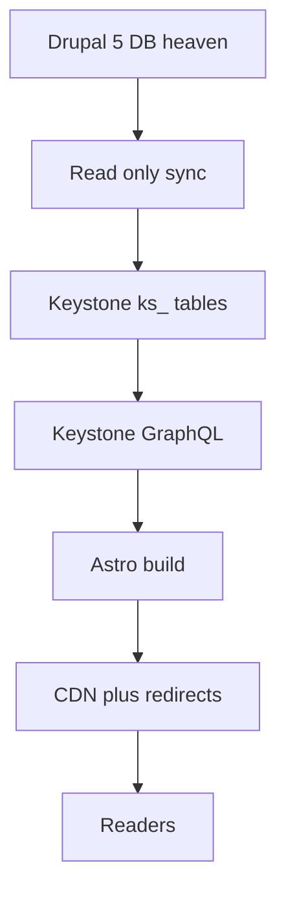

# Migration Status and Project Update — 2025-10-18

This document provides an updated project status and records progress on Gate A (Safety Preflight) execution.

Executive summary
- Target stack: KeystoneJS backend + AstroJS frontend, preserving exact Drupal url_alias .html permalinks.
- Documentation updated to reflect current migration project status.
- Phase 0 (Safety Preflight) in progress with significant documentation cleanup completed.
- Gate A completion expected soon, enabling Phase 2 (Backend Setup) initiation.

Locked decisions and sources
- Direction and phases: [PROJECT_ROADMAP.md](heavenletters-next-stack/docs/PROJECT_ROADMAP.md)
- Canonical URL policy: [URL_SPEC.md](heavenletters-next-stack/docs/URL_SPEC.md)
- Orchestration and gates: [ORCHESTRATOR_ROADMAP.md](heavenletters-next-stack/docs/ORCHESTRATOR_ROADMAP.md)
- Legacy GraphQL parity adapter: [CURRENT_STATUS.md](heavenletters-next-stack/docs/CURRENT_STATUS.md)
- Keystone code entry points: [keystone.ts](heavenletters-next-stack/backend/keystone.ts), [schema.ts](heavenletters-next-stack/backend/schema.ts)
- Environment details (requires sanitization): [DEVELOPMENT.md](heavenletters-next-stack/docs/DEVELOPMENT.md)
- Secrets handling: [SECRETS_POLICY.md](heavenletters-next-stack/docs/SECRETS_POLICY.md), [backend/.env.sample](heavenletters-next-stack/backend/.env.sample)
- Data safety: [DATA_SAFETY_CHECKLIST.md](heavenletters-next-stack/docs/DATA_SAFETY_CHECKLIST.md)
- DBA procedures: [DBA_RUNBOOK_GATE_A.md](heavenletters-next-stack/docs/DBA_RUNBOOK_GATE_A.md)
- Least-privilege grants: [scripts/grant-ks-tables.sh](heavenletters-next-stack/scripts/grant-ks-tables.sh), [db/sql/keystone_least_privilege.sql](heavenletters-next-stack/db/sql/keystone_least_privilege.sql)

System flow (unchanged)

Gate A (Safety Preflight): scope and deliverables
- Sanitize repository docs and configuration
  - Remove plaintext credentials from [DEVELOPMENT.md](heavenletters-next-stack/docs/DEVELOPMENT.md)
  - Add .env usage across backend; add template: [backend/.env.sample](heavenletters-next-stack/backend/.env.sample)
  - Draft a short Secrets Policy: [SECRETS_POLICY.md](heavenletters-next-stack/docs/SECRETS_POLICY.md)
- Rotate secrets
  - Rotate DB password on 192.168.8.103 and update .env (DATABASE_URL); follow [DBA_RUNBOOK_GATE_A.md](heavenletters-next-stack/docs/DBA_RUNBOOK_GATE_A.md)
  - Restrict distribution of rotated secrets to need-to-know
- Provision least-privilege database access
  - Create a MySQL user restricted to ks_% tables only
  - Grants: CREATE, INSERT, UPDATE, SELECT, INDEX; deny ALTER/DROP on legacy Drupal tables
  - Use [scripts/grant-ks-tables.sh](heavenletters-next-stack/scripts/grant-ks-tables.sh) for dynamic grants or [db/sql/keystone_least_privilege.sql](heavenletters-next-stack/db/sql/keystone_least_privilege.sql) for static
- Backups and verification
  - Take a fresh backup of heaven database; verify restore per [DBA_RUNBOOK_GATE_A.md](heavenletters-next-stack/docs/DBA_RUNBOOK_GATE_A.md)
  - Record proof in [DATA_SAFETY_CHECKLIST.md](heavenletters-next-stack/docs/DATA_SAFETY_CHECKLIST.md)
- Documentation outputs
  - Commit [DATA_SAFETY_CHECKLIST.md](heavenletters-next-stack/docs/DATA_SAFETY_CHECKLIST.md) with proof and verification steps
  - Update trackers: [TODO.md](heavenletters-next-stack/docs/TODO.md), [ORCHESTRATOR_ROADMAP.md](heavenletters-next-stack/docs/ORCHESTRATOR_ROADMAP.md)

Acceptance criteria for closing Gate A
- [x] No plaintext secrets remain in repo; [backend/.env.sample](heavenletters-next-stack/backend/.env.sample) and [SECRETS_POLICY.md](heavenletters-next-stack/docs/SECRETS_POLICY.md) committed
- [ ] Rotated DB credentials in use; old credentials invalidated
- [ ] Least-privilege user configured and tested against ks_% tables; legacy tables protected
- [ ] Fresh backup taken; restore verified; steps recorded in [DATA_SAFETY_CHECKLIST.md](heavenletters-next-stack/docs/DATA_SAFETY_CHECKLIST.md)
- [ ] Documentation updated to reflect current project status

Post Gate A next actions (Phase 2 readiness)
- [ ] Finalize Prisma schema for ks_heavenletter (permalink UNIQUE, nid, tnid, locale, dates, tags, embeddings)
- [ ] Install and configure KeystoneJS 6 in backend directory
- [ ] Build read-only sync script with corrected field mappings
- [ ] Test migration with sample data before full execution

Current status and progress
- [x] Documentation Analysis: Completed - identified outdated and redundant files
- [x] CURRENT_STATUS.md: Updated to reflect Phase 0 migration project
- [x] PROJECT_SPECIFICATIONS.md: Updated with current migration requirements
- [x] TESTING_ANALYSIS.md: Updated with migration-focused testing strategy
- [ ] Gate A Completion: In progress - secrets rotation and DB user setup pending
- [ ] Phase 2 Initiation: Blocked until Gate A completion

Ownership and handoff
- Gate owner: Documentation Writer (current) → Orchestrator (pending Gate A completion)
- Implementing agents: Data Safety (lead for secrets/DB setup), Backend (assist for KeystoneJS)
- This document serves as progress record for Phase 0 documentation cleanup

## Documentation Updates Completed

### ✅ **Documentation Cleanup Summary**
- **CURRENT_STATUS.md**: ✅ Updated to reflect actual Phase 0 migration project status
- **PROJECT_SPECIFICATIONS.md**: ✅ Updated with current migration requirements and phases
- **TESTING_ANALYSIS.md**: ✅ Updated with migration-focused testing strategy and validation requirements
- **STATUS_OVERVIEW_2025-10-01.md**: ✅ Updated with current date and progress tracking

### 🔄 **Remaining Gate A Requirements**
- [ ] Complete secrets rotation and least-privilege database user setup
- [ ] Execute and verify fresh database backup procedures
- [ ] Update TODO.md and ORCHESTRATOR_ROADMAP.md with current progress
- [ ] Obtain final Gate A approval for Phase 2 transition

### 📋 **Updated Project Timeline**
- **Phase 0 Completion**: Expected within 1-2 days (pending DB security setup)
- **Phase 2 Kickoff**: Immediately following Gate A approval
- **Backend Development**: 1-2 weeks for KeystoneJS setup and migration script
- **Overall Migration**: On track for completion within original timeline

References
- [PROJECT_ROADMAP.md](heavenletters-next-stack/docs/PROJECT_ROADMAP.md) - Current authoritative roadmap
- [TODO.md](heavenletters-next-stack/docs/TODO.md) - Detailed task breakdown and progress
- [URL_SPEC.md](heavenletters-next-stack/docs/URL_SPEC.md) - Canonical URL preservation strategy
- [VMA.md](heavenletters-next-stack/docs/VMA.md) - Vision, Mission, and Aims
- [ORCHESTRATOR_ROADMAP.md](heavenletters-next-stack/docs/ORCHESTRATOR_ROADMAP.md) - Orchestration and gate management
- [CURRENT_STATUS.md](heavenletters-next-stack/docs/CURRENT_STATUS.md) - Updated current project status
- [DEVELOPMENT.md](heavenletters-next-stack/docs/DEVELOPMENT.md) - Database and environment setup
- [SECRETS_POLICY.md](heavenletters-next-stack/docs/SECRETS_POLICY.md) - Security and secrets management
- [DATA_SAFETY_CHECKLIST.md](heavenletters-next-stack/docs/DATA_SAFETY_CHECKLIST.md) - Safety verification procedures
- [DBA_RUNBOOK_GATE_A.md](heavenletters-next-stack/docs/DBA_RUNBOOK_GATE_A.md) - Database administration procedures

---

**Last Updated**: 2025-10-18T22:15:00Z
**Document Status**: 🔄 ACTIVE - Documentation cleanup completed, Gate A execution in progress